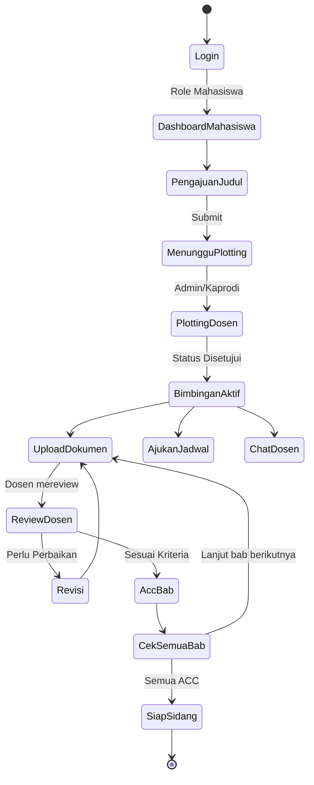

# Activity Flow - BIMSI UBSI

## 1. Activity Flow Proses Utama (Bimbingan Skripsi)

## 2. Penjelasan Flow
1. **Pengajuan**: Mahasiswa mengajukan judul skripsi melalui aplikasi.
2. **Plotting**: Admin atau Kaprodi menerima pengajuan dan menentukan siapa dosen pembimbingnya.
3. **Bimbingan Berjalan**: Mahasiswa dapat mengunggah file revisi dan dosen dapat memberikan feedback. Komunikasi dibantu dengan fitur Chat.
4. **Approval**: Setiap bab yang selesai akan di-ACC oleh Dosen.
5. **Selesai**: Jika seluruh komponen di-ACC, mahasiswa berstatus "Siap Sidang".
