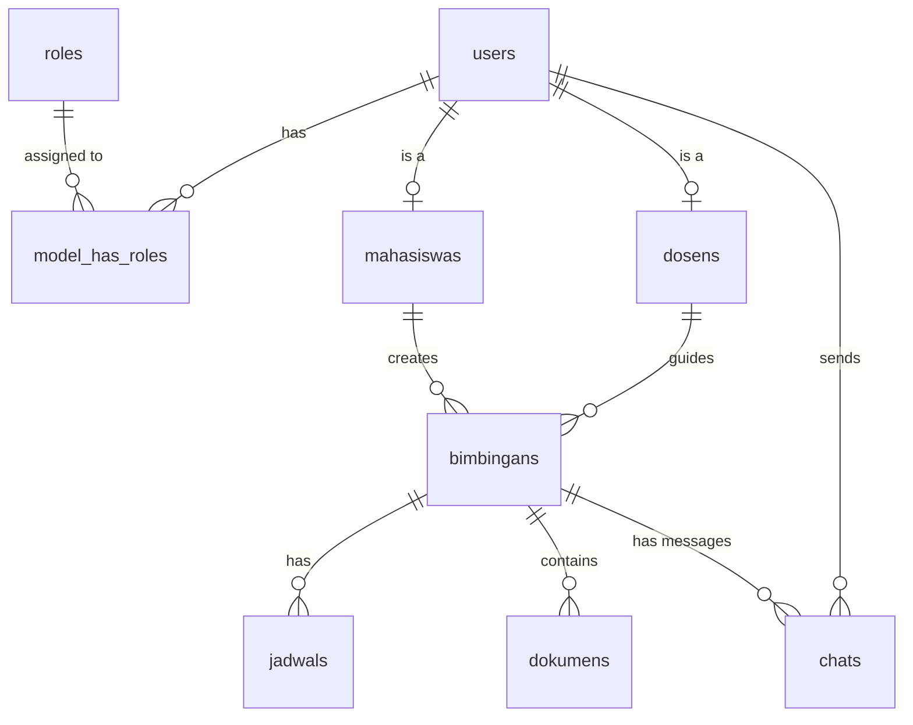

# Entity Relationship Diagram (ERD) - BIMSI UBSI

## 1. Daftar Tabel
- `users`: Data utama pengguna (mahasiswa, dosen, kaprodi, admin, super_admin).
- `roles`: Data hak akses.
- `model_has_roles`: Tabel pivot role.
- `mahasiswas`: Detail spesifik mahasiswa (NIM, prodi, angkatan), berelasi 1-1 ke users.
- `dosens`: Detail spesifik dosen (NIDN, jabatan), berelasi 1-1 ke users.
- `bimbingans`: Data utama pengajuan skripsi.
- `jadwals`: Sesi bimbingan yang diajukan.
- `dokumens`: File draft skripsi/revisi yang diupload mahasiswa.
- `chats`: Riwayat pesan diskusi antara mahasiswa dan dosen.

## 2. Diagram ERD (Mermaid)

## 3. Relasi Antar Tabel
1. **users - model_has_roles - roles**: Relasi Many-to-Many untuk Role Based Access Control (Spatie).
2. **users (1) - (1) mahasiswas**: Setiap entitas user dengan role mahasiswa akan punya detail di tabel `mahasiswas`.
3. **users (1) - (1) dosens**: Setiap entitas user dengan role dosen akan punya detail di tabel `dosens`.
4. **mahasiswas (1) - (M) bimbingans**: Satu mahasiswa bisa memiliki satu atau lebih catatan bimbingan (namun biasanya 1 aktif).
5. **dosens (1) - (M) bimbingans**: Satu dosen membimbing banyak bimbingan mahasiswa.
6. **bimbingans (1) - (M) jadwals**: Satu topik bimbingan memiliki banyak jadwal pertemuan/revisi.
7. **bimbingans (1) - (M) dokumens**: Satu topik bimbingan memiliki banyak dokumen draft skripsi.
8. **bimbingans (1) - (M) chats**: Satu bimbingan menaungi banyak pesan diskusi (seperti room chat).
9. **users (1) - (M) chats**: Satu user (pengirim) bisa mengirim banyak pesan.
