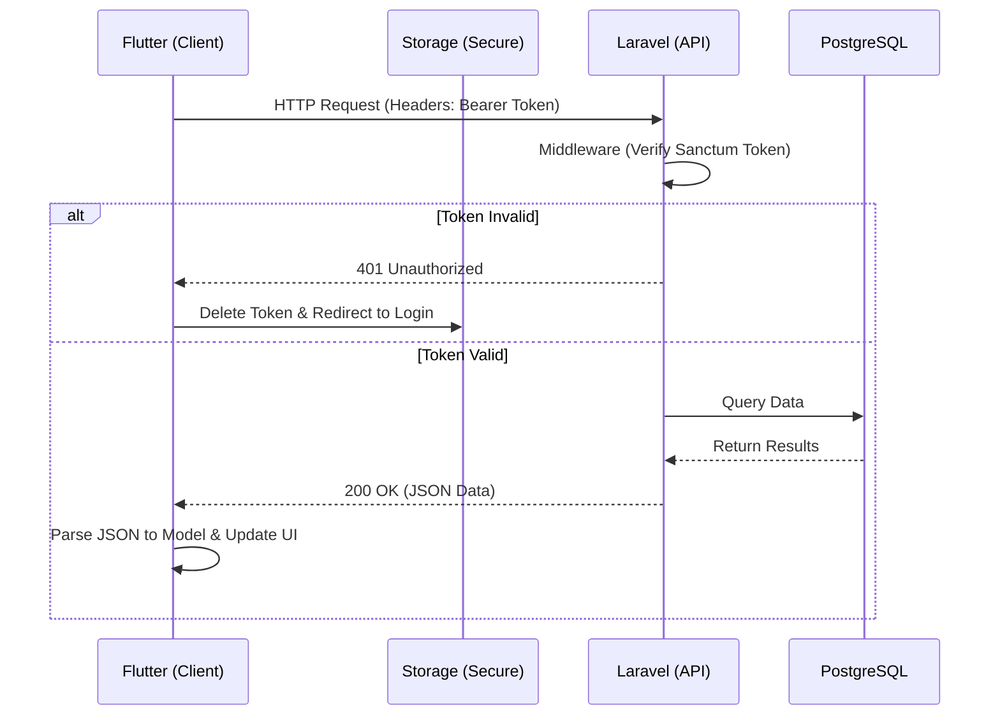
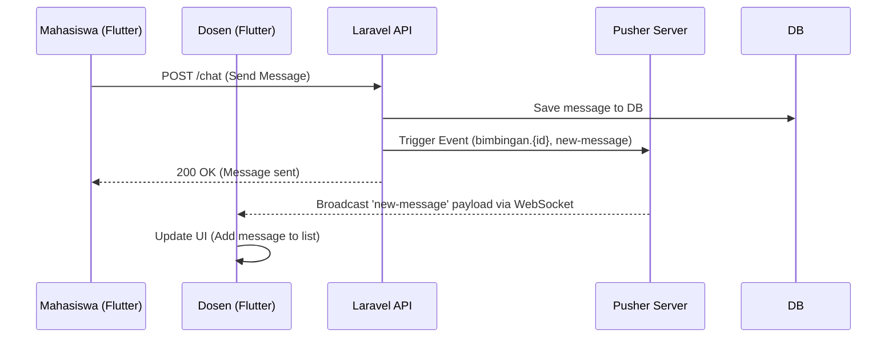
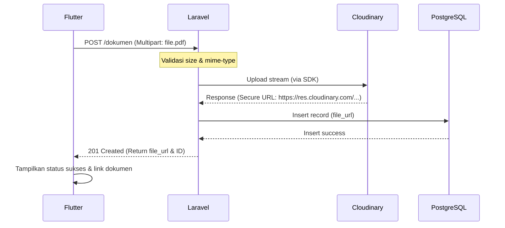
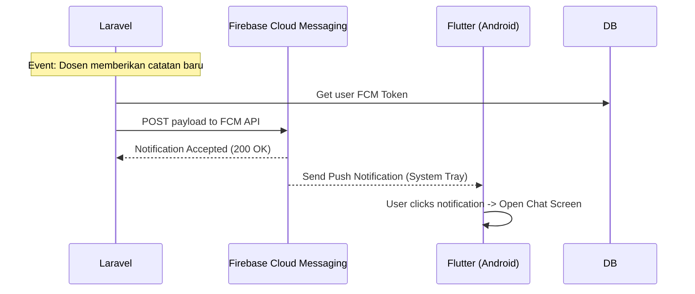

# Sequence Flow - BIMSI UBSI

Dokumen ini merangkum alur spesifik antara Client (Flutter) dan Server (Laravel), serta provider eksternal.

## 1. Sequence Flow Umum (Flutter ke Laravel)

## 2. Sequence Flow Realtime (Pusher Channels)

## 3. Sequence Flow Upload Dokumen (Cloudinary)

## 4. Sequence Flow Push Notification (Firebase)

